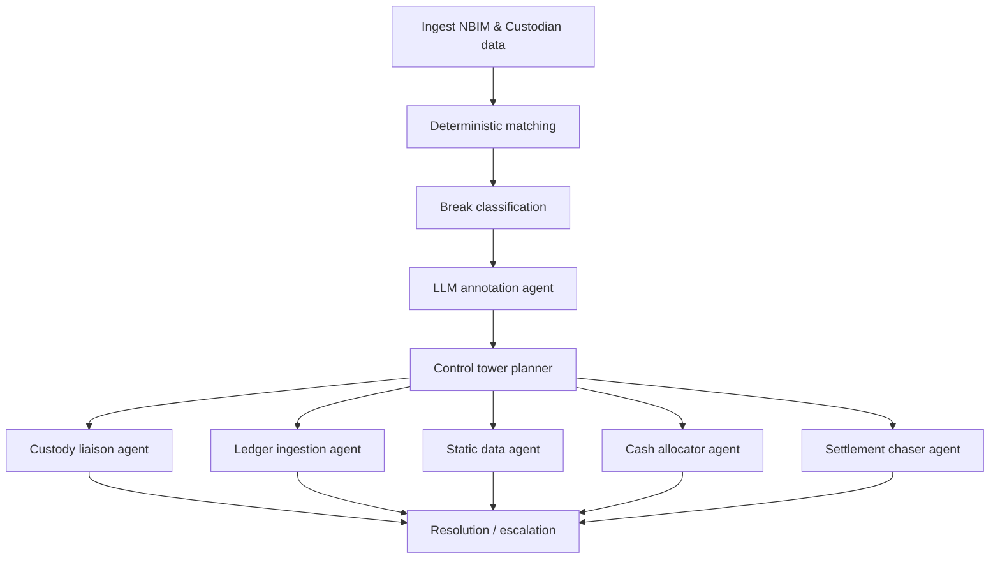

# Agent-based architecture vision

## High-level flow

## Components

1. **Deterministic core** – existing Python modules (`normalization`, `matching`, `checks`) provide auditable matching and break reason codes.
2. **LLM annotation agent** – implemented in `recon.llm`. It consumes structured break data and returns:
   - severity normalised to NBIM triage levels,
   - narrative explanation,
   - recommended actions,
   - confidence and escalation flags.
3. **Control tower** – see `recon.agents.ControlTower`. It orchestrates downstream specialist agents based on LLM output and rule metadata, exporting an actionable task queue (`recon_agent_plan.json`).
4. **Specialist agents** – conceptual roles that can be implemented via OpenAI/Anthropic functions, internal bots or RPA:
   - *Custody Liaison*: drafts SWIFT / email outreach using context from the plan.
   - *Ledger Ingestion*: inspects NBIM pipelines, triggers retries, reconciles static data.
   - *Static Data*: compares FX and security master attributes, suggests updates.
   - *Cash Allocator*: recomputes dividend cash flows and tax, updates ledgers.
   - *Settlement Chaser*: polls settlement systems, schedules follow-ups.
5. **Human-in-the-loop** – escalations flagged by the LLM or deterministic rules are routed to supervisors with the Markdown report for audit.

## Extensibility roadmap

- **Auto-remediation loops** – connect each specialist agent to workflow APIs (ServiceNow, Calypso, SWIFT) to execute recommended actions.
- **Learning feedback** – capture operator decisions to fine-tune prompts and guardrail classifications.
- **Scenario simulations** – use LLMs to generate synthetic reconciliation stress tests and rehearse incident response.
- **Spend guardrails** – throttle LLM calls per break type and cache responses for repeated events to stay within the $15 budget.
